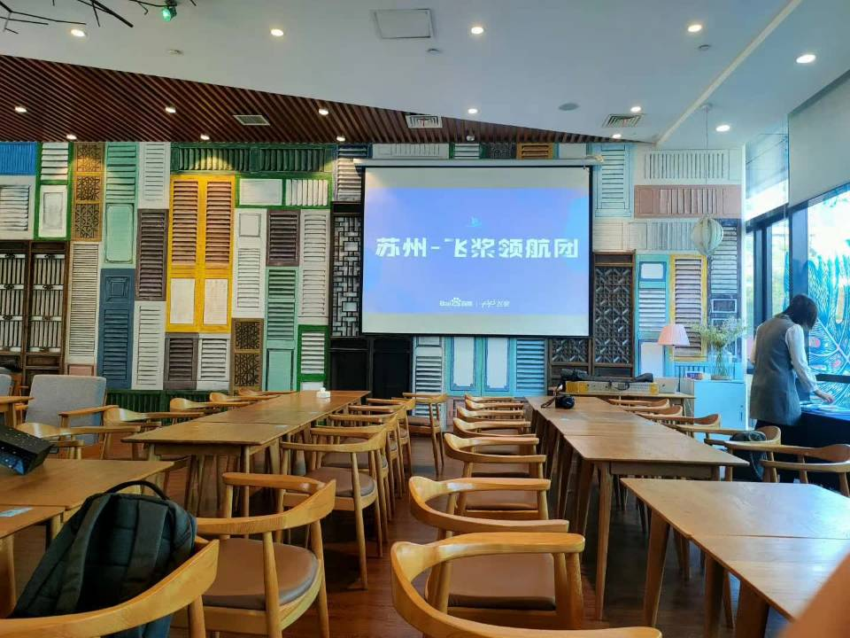
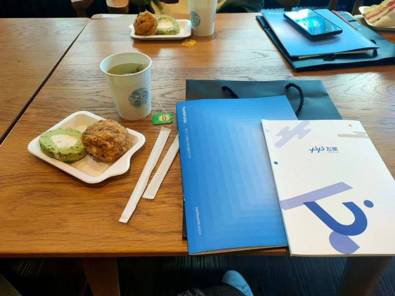
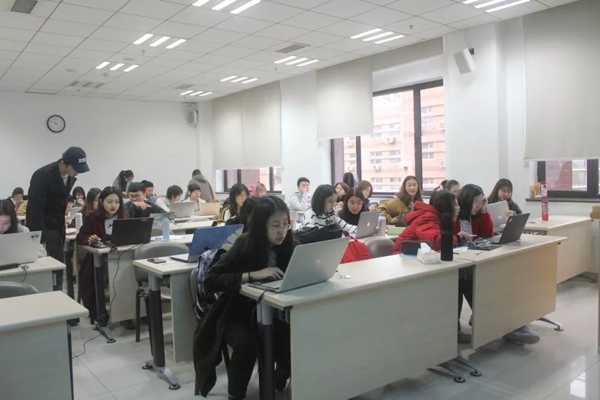
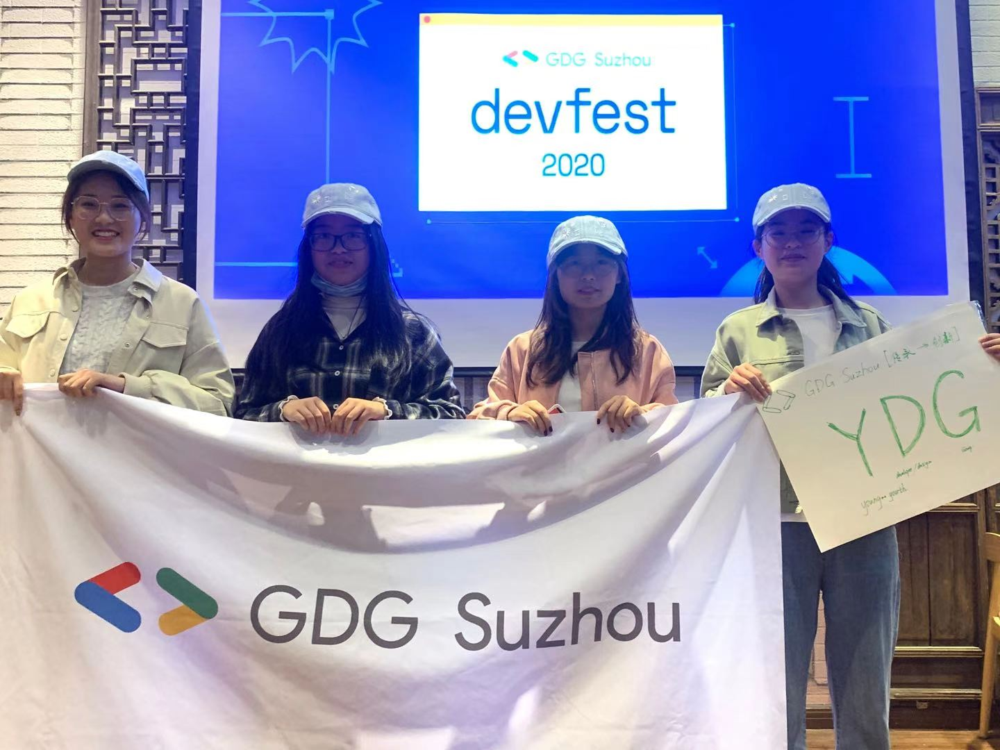

# 科技遇见她
## 分享你与科技的#HREstory
### 一小时编程挑战直播课
#### 等你来挑战~

# 科技遇见她

## 分享你与科技的#HREstory

### 一小时编程挑战直播课

#### 等你来挑战！！

我和科技的故事，要从20年说起~

#### 2020.10.25     苏州-飞桨领航团

一次机缘巧合，加入了齐伟老师的读者群，一起在里面潜水，看着老师不时分享的推文，浑浑噩噩地过着一天又一天……

一次数据挖掘课上，李晓楠老师告诉我们，本周末有个沙龙，推荐对数据挖掘和编程感兴趣的同学参加，闲来无事，便约着朋友去了……

沙龙活动上说了什么已经不大记得，只是记得中场休息的免费茶点倒是不错！嘻嘻嘻

这次活动虽然收获不多，但也算是见了见市面，对编程有了一些了解。

#### 2020.10.25     GDG-苏州

DevFest，开发者节，即 Developer Festival，由全球 GDG 社区组织运营，是全球开发者们的技术盛宴。目的在于通过技术分享来推动最新互联网开放型技术的使用，用技术来解决生活中的实际问题。当开发者以及未来开发者聚集在一起交换想法，可能会产生惊人的能量。

又是一次机缘巧合，了解到了Devfest，约上了ERP家族一起去玩（吃点心）。

有几位行业大佬分享了自己在业界的项目和经验，我尤其对张雪老师分享的《苏绣的当代发展》很感兴趣。张雪老师是一位85后的“姑苏绣郎”，生于苏州镇湖刺绣世家，骨子里的苏绣情结一脉相承，作为非物质文化遗产传承人，创立了弥惟刺绣研习所，还大胆地把苏绣带到了手表、耳机、珠宝乃至游戏中，让苏绣更好地融入现代生活，让苏绣焕发新的生命力。

在分享结束后，我们分组进行了小组讨论。惊险刺激的时刻来了！！！初出茅庐的我们被迫打开脑洞，畅谈自己的想法，在讨论结束后，我还和我的舍友一起上台将我们小组的讨论成果进行了展示，得到了很多行业大佬的夸奖，这无疑是给了我们强大的鼓励和支持！

### 故事未完待续……

